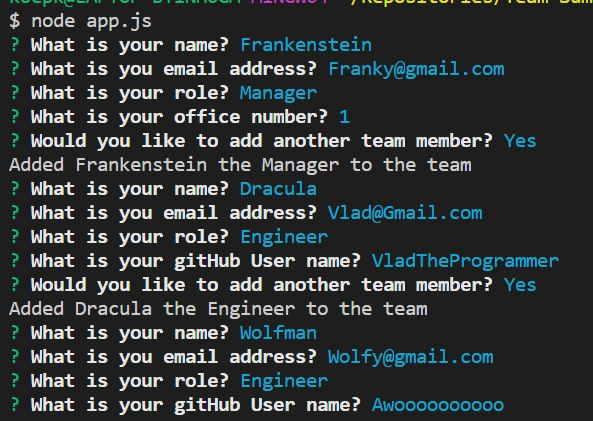
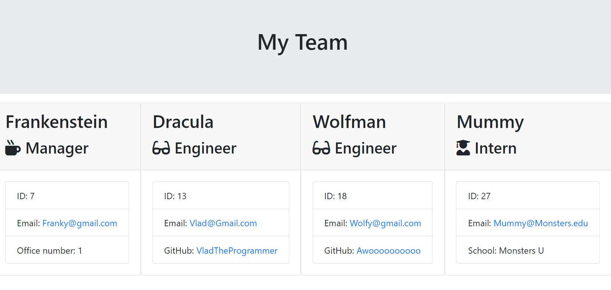

# Team-Summary
An easy to use tool to organize and diplay your team.  From Mangers, to Engineers and Interns

## Table of Contents
  * [Installation](#installation)

  * [Usage](#usage)
  
  * [License](#license)
  
  * [Tests](#tests)
  
  * [Questions](#questions)

  ## Installation 
  Install node.js and download Team-Summary files

  ## Usage Instructions 
  run "node app.js" and answer the questions as they appear in the terminal to fill out your team.
  

  Once you've finished building your team, open team.html to see your Lineup.
  

  ## License 
  N/A

  ## Tests
  Test files are included 

  ## Questions
  Reach out if you have any questions

